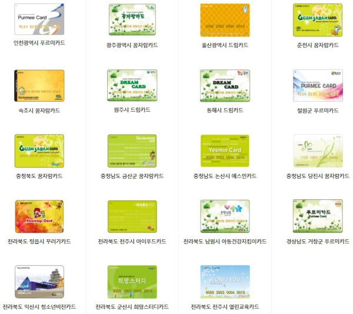

# IF_EXPRESS
## 급식카드행복열차
---
* 2005년 이래 각 지자체에서 결식아동 급식사업의 일환으로 저소득층 아이들에게 발급하는 IC 카드[1]. 경제적 빈곤 상태에 놓여 있는 가정의 자녀가 학교에서 급식을 먹지 못할 경우 학교 바깥에서 급식에 준하는 식사를 할 수 있도록 정부에서 보조하는 카드이다.
---
* 지역마다 끼니당 지원하는 금액이 조금씩 다른데, 대표적으로 서울의 경우 1식에 5000원, 부산은 3000원(2017년 기준)을 지원한다.
---

---
## * 문제점
1. 현실 기준과 동떨어진 지원 금액
    1. 일반적인 1식 지원액은 5000원 안팎. 5000원으로 점심과 저녁을 해결하기에는 실질적으로 부족하다.
    2. 대학가나 주택가 골목 근처에는 5천원 정도의 백반을 제공하기도 하지만, 급식카드는 반드시 해당 식당이 가맹되어 있는 경우에만 사용 가능하다.
2. 낮은 가맹점 수
    1. 거래가 카드로 이루어지기 때문에, 소득 노출을 꺼려하는 자영업자들이 가맹을 꺼려하는 경향이 있다.
    2. 식당에 갈 때마다 급식카드 사용이 가능하냐고 물어봐야 하는 현실
3. 편의점으로의 집중
    1. 식품의 개당 단가가 일반 식당에 비해 낮으며, 가격 대비 식품 선택의 폭이 넓고, 결제도 안정적으로 할 수 있는 편의점으로 결식아동이 몰리게 된다.
    2. 그러나 편의점 식품의 특성상 균형잡힌 영양소 섭취가 어렵고, 패스트푸드 위주의 식단에, 신선한 채소와 과일 구매가 어렵다.
    3. 즉석식품/과일/유제품/반찬류/난각류 등으로 구매 가능 품목이 제한되어 있다. 즉, 과자나 탄산음료 등의 구매가 불가능하다.
